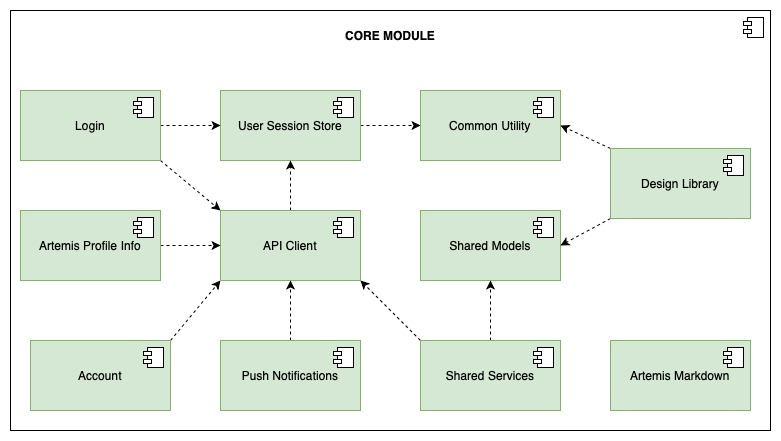

# ArtemisCore

ArtemisCore is a SPM package containing modules which can be used accross all Artemis related iOS apps.

## Clients Overview

The package is currently used by the following iOS clients:

- [Artemis iOS App](https://github.com/ls1intum/artemis-ios) (referred to as the App) – Native iOS application for Artemis
- [Artemis Exam Participation Checker App](https://github.com/ls1intum/ArtemisExamChecker) (referred to as the Exam Checker) – an iPad app designed to streamline the process of checking student attendance during on-site exams conducted with the Artemis platform
- [Themis](https://github.com/ls1intum/Themis) – an iPad app that provides a comprehensive and optimized way for tutors to assess student submissions on the go.

# Modules Overview

- **APIClient**: A lightweight API client based on Apple's URLSesssion
- **Common**: Contains common functionality like logging, utility functions and network-state wrappers
- **DesignLibrary**: Contains Artemis-Web lookalike UI Elements, like buttons, textfields, etc... 
- **UserStore**: Is used for storing user session related data, like login data and push notification information
- **PushNotifications**: Contains all handlers to receive notifications from the Artemis server
- **SharedModels**: Contains the domain models used by the server
- **ProfileInfo**: A small service to receive the Artemis instance information
- **Login**: Contains Views and services to authenticate the user with an Artemis instance
- **SharedServices**: Contains API services for shared REST handlers
- **ArtemisMarkdown**: Contains a Markdown view for handling custom Artemis Markdown

# Installation Guide

## Swift Package Manager

### Add to Xcode project

In Project Settings, on the tab "Package Dependencies", click "+" and add <https://github.com/ls1intum/artemis-ios-core-modules>

### Add to Package.swift based SPM project

1. Add a dependency in Package.swift:
```swift
dependencies: [
    .package(url: "https://github.com/ls1intum/artemis-ios-core-modules", .upToNextMajor(from: "9.1.0")),
]
```

2. For each relevant target, add a dependency with the product name from section 1, e.g.:
```swift
.target(
    name: "Example",
    dependencies: [
        .product(name: "SharedModels", package: "artemis-ios-core-modules"),
    ]    
)
```

# Module Architecture



*Figure: Subsystem decomposition of the `Core Module`.*

#### Common Utility
The Common Utility subsystem provides essential utility functions, encompassing a network state wrapper, logging functionality, and date formatting.
Almost all other `Core Module`s extensively utilize this subsystem.
Furthermore, all clients, including `App`, `Exam Checker`, and `Themis`, use this subsystem.

#### Shared Models
The Shared Models subsystem houses all the Artemis domain models required by any of the clients.
It includes computed properties with design elements for domain objects, such as the exercise icon, varying based on the exercise type.
This subsystem is crucial for network communication and its data encryption.
It also ensures consistency and efficiency in data handling across different clients.
All clients within the system utilize the Shared Models subsystem.

#### User Session Store
The User Session Store subsystem stores user-session-related data, encompassing login data and push notification keys.
Additionally, it houses configurations about the Artemis instances and maintains a record of the selected instance.
It is important to note that this subsystem is exclusively utilized within the `Core Module`, with no direct usage by any client.

#### API Client
The API Client subsystem is a lightweight API client built upon Apple's URLSession.
It provides a straightforward method for sending REST requests and supports the content-types 'application/json' and 'multipart/form-data'.
This subsystem is responsible for encrypting requests and decryption of responses, ensuring secure data transmission.
Additionally, it handles logging and some aspects of error handling, contributing to the system's robustness.
The API Client also includes a simple STOMP web socket client, facilitating real-time communication.
The API Client subsystem is critical for all other subsystems that necessitate network communication.
Its role is to ensure seamless and efficient data exchange within the system, enhancing its overall functionality and performance.

*[STOMP documentation](https://stomp.github.io/stomp-specification-1.2.html)*

#### Shared Services
The Shared Services subsystem operates with the API Client to deliver service functionality to all other subsystems.
This approach ensures that common API calls are not repetitively implemented across different subsystems, promoting code reuse and efficiency.
The subsystem comprises an *AccountService*, *CourseService*, and *ExerciseService*, each providing the necessary calls for their respective services.
The `App` and `Themis` clients extensively utilize this subsystem.

#### Design Library
The Design Library subsystem is a comprehensive collection of UI elements that mirror the aesthetics of the `Webapp`. It encompasses a variety of components, such as buttons, text fields, chips, progress bars, and card modifiers. Additionally, it houses commonly utilized styles, including paddings, colors, and font sizes. It also encapsulates some UIKit components like the 'QLPreviewController' or 'WKWebView', offering SwiftUI versions of these elements. This subsystem is integral to all other subsystems and clients that incorporate UI, enhancing the visual consistency and user experience across the system.

#### Artemis Markdown
The Artemis Markdown subsystem provides a MarkdownView, a crucial component for rendering the partially custom markdown Artemis utilizes. 
This subsystem is adept at handling and displaying this custom markdown.
Currently, the `App` exclusively employs this module to display lecture descriptions or messages within the instant message feature.
This selective use may expand in the future as the system evolves.

#### Login
The Login subsystem manages the authentication flow of Artemis, providing both the user interface for login and the corresponding service layer.
It facilitates institution selection, enabling users to switch between different Artemis instances.
All three clients, `App`, `Exam Checker`, and `Themis`, employ this subsystem.
Further, the login subsystem utilizes the User Session Store to retain authentication information.

#### Artemis Profile Info
The Artemis Profile Info subsystem primarily supports the Login subsystem by verifying the compatibility of the chosen Artemis instance with the client.
This subsystem is service-oriented and does not incorporate any user interface components.

#### Account
The Account subsystem manages user account operations. 
It provides the functionality to view account information and log out of the current user.
A navigation bar menu, integrated across all clients, facilitates the detail view. 

#### Push Notifications
The Push Notifications subsystem manages all aspects related to push notifications.
It encompasses the push notification setup user interface and the notification settings interface.
Further, it includes handlers for the decryption and deep-linking of notifications.
The User Session Store securely stores encryption keys. Currently, the `App` exclusively utilizes this subsystem.
